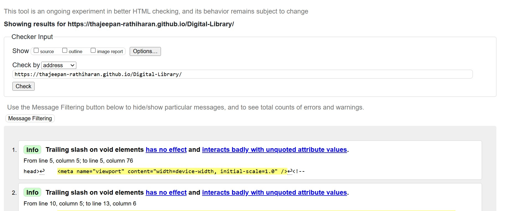
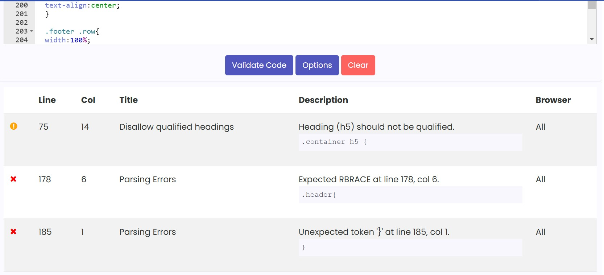
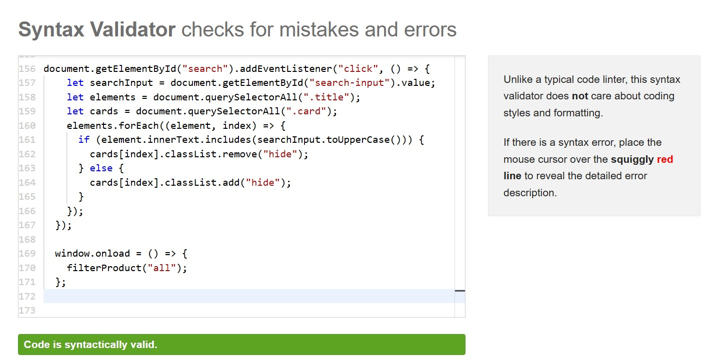
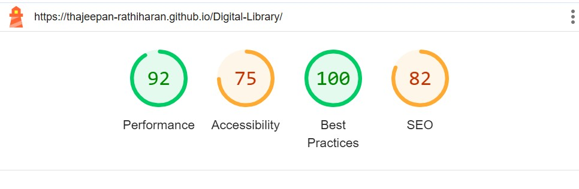

# Digital Library

This is a short project I came up with after visiting the library. I have always wanted to have my own library, so I thought what's the best way to do it, and thought of creating my own using HTML, CSS and JavaScript.
It's not an exact replica of what is in my imagination, but digital wise, this will do.

### [Website link](https://thajeepan-rathiharan.github.io/Digital-Library/)

## Features of the site

* Feature 1 - Simple design.
* Feature 2 - Has a search bar which can bring up a book that you see.
* Feature 3 - Fully functioning tabs that load up different books.

## Technology used

* Visual Studio Code was used as the code editor for this project.
* HTML is the coding language used to make the basic structure of the site via the headings, texts and images.
* CSS is used to style the HTML code of the website.
* JavaScript is used to make the site interactive.
* Git provides source control to commit and push code to the repository.
* Github is used to host the site.

## Testing of the site

I tested my website using online tools such as: 
* [HTML WC3 Markup Validation Service](https://validator.w3.org/)
* [CSS WC3 Markup Validation Service](https://www.cssportal.com/css-validator/)
* [JavaScript Validation Servce](https://esprima.org/demo/validate.html)

### HTML WC3 Markup Validation Service

First the website was put through the [HTML WC3 Markup Validation Service](https://validator.w3.org/) and it came back with no errors on the html validator. It shows that some warnings, but they aren't anything major that distrups the loading time of the website, nor does it affect the content that is shown.

### CSS WC3 Markup Validation Service

Then the website was also put through the [CSS WC3 Markup Validation Service](https://www.cssportal.com/css-validator/) and it came back with no errors on the css validator. It came back with a warning and an error, but the errors are showing up as the CSS rules shown aren't linked to the html as they don't appear until the element appears when clicking on one of the genre options.

### JavaScript Validation Service

Finally the website was tested through the [JavaScript Validation Service](https://esprima.org/demo/validate.html) and it came back with no errors on the jshint validator.

### Performance check

Page loading times and performance of the quiz website was checked through the open source tool called 'Google Lighthouse'. Overall, it is performing at a decent rate, there is room for improvement, but as this is just a random project I'm not too bothered about the Accessibility and SEO having a score below 90.

## Deployment

The website was deployed to Github in the following method:
  
1. Going to my GitHub repository on GitHub.
2. Clicking on "Settings" in my repository.
3. Clicking on "Pages"(tab on the left sidebar) in my repository.
4. Scrolling down to "Build and deployment"/"Source" section.
5. Find the sub-section "Branch".
6. From the drop-down menu "none"/"select branch" and choose source "main".
7. Click 'Save'.
8. Then got the link to my site once it was deployed on GitHub.